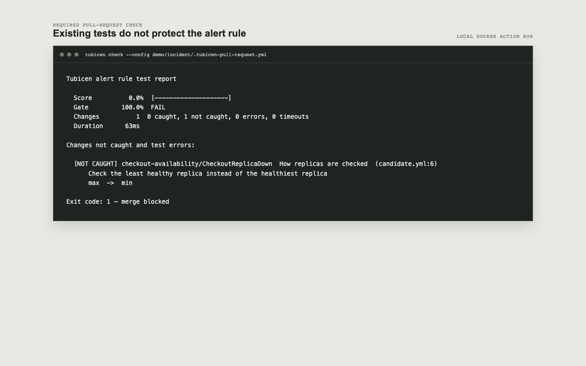
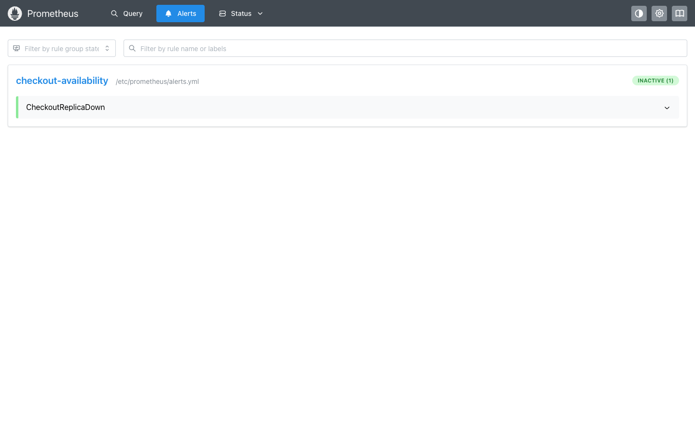
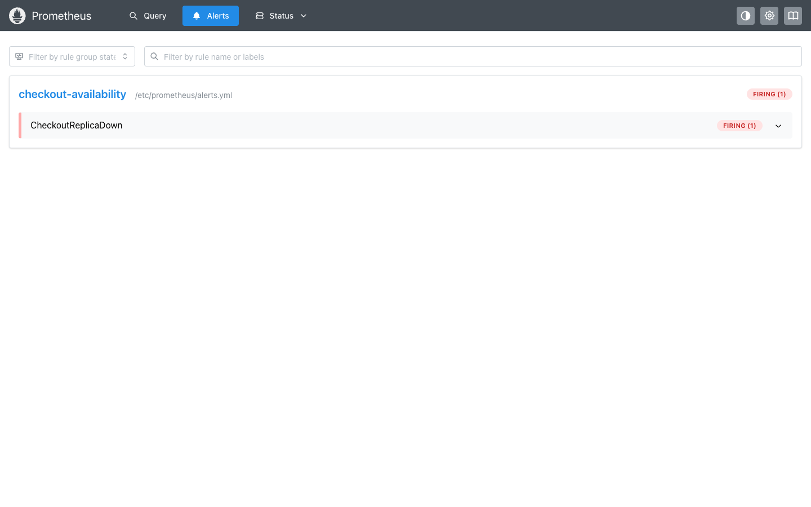
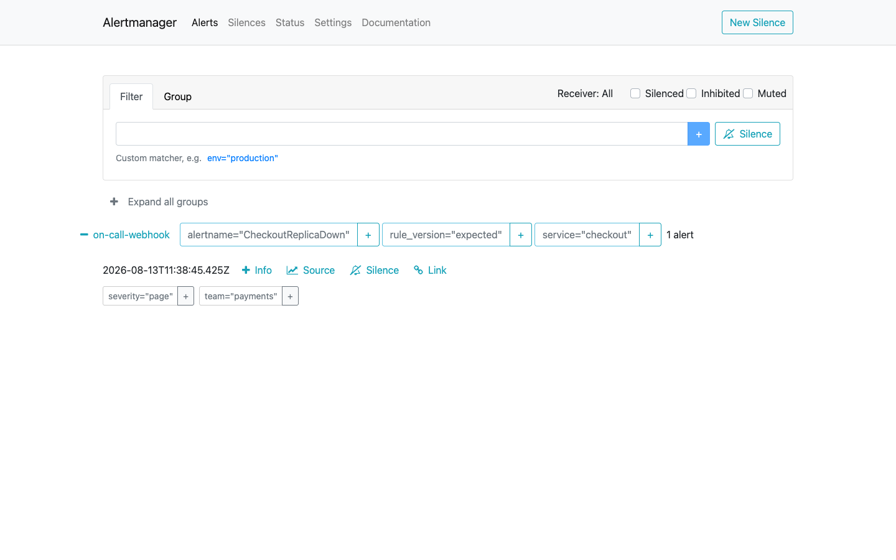
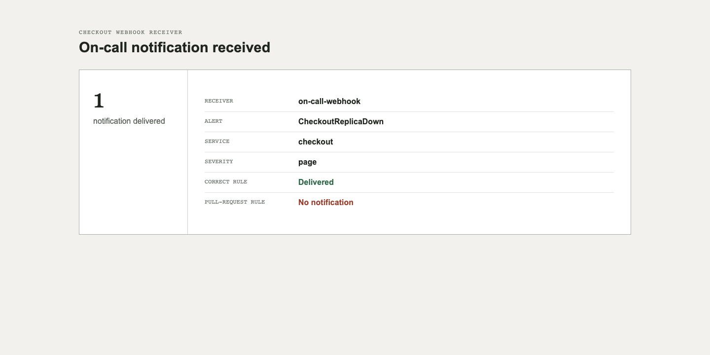
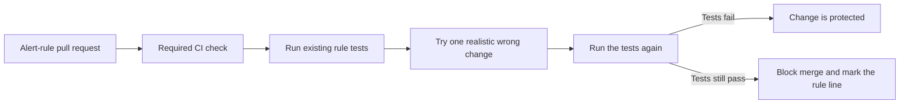

<p align="center">
  
</p>

<h1 align="center">Tubicen</h1>

<p align="center"><strong>Stop alert-rule changes that would silence a production page.</strong></p>

<p align="center">
  <a href="https://github.com/iahsanGill/tubicen/actions/workflows/ci.yml"></a>
  <a href="https://pkg.go.dev/github.com/iahsanGill/tubicen"></a>
  <a href="LICENSE"></a>
</p>

Tubicen is a command-line check for repositories that keep Prometheus alert rules in Git. It runs in pull-request CI, next to the existing rule tests. If those tests would allow a dangerous change through, the job fails and points to the unprotected rule.

It does not monitor production, replace Prometheus, or require a web service. Prometheus evaluates live metrics. Alertmanager sends notifications. Tubicen runs before deployment and checks the tests that protect their configuration.

## The problem it catches

Suppose checkout has two replicas. The team must be paged when either replica is down:

```promql
min by (service) (up{service="checkout"}) == 0
```

A pull request changes `min` to `max`. The new rule pages only when both replicas are down. An old test with a single failed replica still passes because, with one replica, `min` and `max` return the same value.

That means all of these can be true at once:

- the alert rule is valid;
- its tests are green;
- one production replica is down;
- the on-call engineer receives no page.

Starting from the pull-request rule, Tubicen tries the opposite replica calculation (`max` to `min`) in a temporary copy and reruns the tests. When the old test stays green, Tubicen blocks the pull request: the suite cannot distinguish “every replica” from “any replica.”

The fix is a test containing one healthy and one failed replica. That test rejects the harmful rule and lets the correct rule pass.

## Normal use: a pull-request check

Add a policy file to the repository that owns the alert rules:

```yaml
# .tubicen.yml
rules:
  - monitoring/alerts.yml
tests:
  - monitoring/alerts_test.yml

threshold: 90
workers: 4
timeout: 30s
quiet: true

reports:
  json: artifacts/tubicen.json
  junit: artifacts/tubicen.xml
  sarif: artifacts/tubicen.sarif
```

Then make it a required pull-request check. This repository uses the local action while developing it:

```yaml
# .github/workflows/alert-rules.yml
name: Alert rules

on:
  pull_request:
    paths:
      - "monitoring/**"
      - ".tubicen.yml"

jobs:
  check:
    runs-on: ubuntu-latest
    steps:
      - uses: actions/checkout@v6
      - name: Check alert rule tests
        uses: ./
```

Once a release tag exists, another repository can replace `./` with `iahsanGill/tubicen@v1`. The action packages Tubicen and the matching `promtool` binary in one container. A failed check returns exit code `1` and creates an annotation on the relevant rule line. JSON, JUnit, and SARIF outputs are available for CI systems that store test results or code-scanning findings.

The same contract works outside GitHub Actions:

```bash
tubicen check --config .tubicen.yml
```

Exit codes are stable:

| Code | Meaning |
| ---: | --- |
| `0` | The alert tests met the repository policy. |
| `1` | The check ran, but the tests missed too many rule changes. |
| `2` | The policy, original rules, original tests, or test runner failed. |

## Run the incident end to end

The repository contains a complete, local reproduction rather than a mocked UI:

```bash
./demo/incident/run.sh
```

Docker Compose starts two checkout replicas, two Prometheus servers, Alertmanager, a webhook receiver, and Tubicen. The script proves the whole sequence:

1. The harmful rule passes the old test.
2. Tubicen finds that the tests do not protect the `min`/`max` distinction.
3. One live checkout replica is stopped.
4. Prometheus running the harmful rule stays quiet.
5. Prometheus running the correct rule fires.
6. Alertmanager delivers the page.
7. The added test rejects the harmful rule before deployment.
8. Tubicen confirms that the corrected suite protects this behavior.

See [demo/incident/README.md](demo/incident/README.md) for the incident, services, ports, and manual inspection commands.

### Captured from the running demo

The old Prometheus test passes the harmful rule. The required repository check does not: it returns exit code `1` and identifies the unprotected replica behavior.



Both Prometheus servers below watched the same two checkout containers after `checkout-2` was stopped. The only difference was the alert expression mounted into each server.

<table>
  <tr>
    <th>Pull-request rule: no page</th>
    <th>Correct rule: page fires</th>
  </tr>
  <tr>
    <td></td>
    <td></td>
  </tr>
</table>

Alertmanager grouped the firing alert for the `on-call-webhook` receiver. Its labels show that the notification came from the expected rule; no notification from the pull-request rule was delivered.



The checkout webhook receiver stored one real Alertmanager payload. The payload carried the expected rule version; the pull-request version produced none.



## What the check does

For every supplied alert rule, Tubicen:

1. uses Prometheus' own tools to check the original rule and run the original tests;
2. parses the PromQL expression;
3. makes one controlled change in an isolated temporary file;
4. validates that changed rule with `promtool check rules`;
5. reruns the test suite with `promtool test rules`;
6. records whether the tests caught the change;
7. enforces the score required by `.tubicen.yml`.

The source rules and tests are never edited. Independent changes run in parallel, while report order and identifiers stay stable.



## Changes currently tested

| Rule behavior | Examples |
| --- | --- |
| Comparison | `>` to `>=`, `>` to `<`, `==` to `!=` |
| Threshold | raise, lower, or move a zero boundary |
| Wait before firing | remove, halve, double, or add `for` |
| Metric time window | shorten or lengthen `[5m]` |
| Replica or group calculation | `min` to `max`, `sum` to `avg` |
| Metric calculation | `rate` to `irate`, `avg_over_time` to `sum_over_time` |
| Metrics included | `environment="prod"` to `environment!="prod"` |
| Combined conditions | `and` to `or`, `or` to `and`, `unless` to `and` |

These are generated from the PromQL syntax tree, not by string replacement. Every changed expression is parsed again before it can be tested.

## Local installation and advanced use

Requirements: Go 1.25 or newer and a `promtool` version with `test --junit` support on `PATH`.

```bash
go install github.com/iahsanGill/tubicen/cmd/tubicen@latest
tubicen check
```

The container includes `promtool`:

```bash
docker build --target cli -t tubicen .
docker run --rm --user "$(id -u):$(id -g)" \
  -v "$PWD:/workspace" -w /workspace \
  tubicen check --config .tubicen.yml
```

Use `tubicen run` when flags are more convenient than a repository policy:

```bash
tubicen run \
  --rules monitoring/alerts.yml \
  --tests monitoring/alerts_test.yml \
  --threshold 90 \
  --only aggregation,threshold,for
```

`tubicen list --rules monitoring/alerts.yml` previews the changes without running tests. `--survivors artifacts/rules` saves rule copies that were not caught for local investigation. Full CLI options are available with `tubicen run --help`.

The HTML report is optional and intended only as a saved CI artifact for reviewing a completed run. It is not the operating interface.

## Design and limits

The implementation is split into rule loading, PromQL change generation, isolated `promtool` execution, scoring, and reporting. [docs/architecture.md](docs/architecture.md) describes package boundaries, concurrency, failure handling, and the trust model.

Current limits:

- Alerting rules and `promtool` rule-test files are supported; recording-rule changes are not yet generated.
- A missed change identifies a test gap. It does not prove that the changed rule would cause an incident in every environment.
- Some generated changes can be equivalent for a particular rule or metric domain. They remain visible for engineering review.
- Run time grows with the number of rules and generated changes; worker concurrency is bounded.

Development checks:

```bash
make check     # format, vet, unit tests, race detector
make policy    # run this repository's .tubicen.yml policy
make demo      # reproduce the live missed-page incident
```

The name comes from the Roman *tubicen*, a military trumpeter responsible for transmitting signals. Tubicen is available under the [MIT License](LICENSE).
