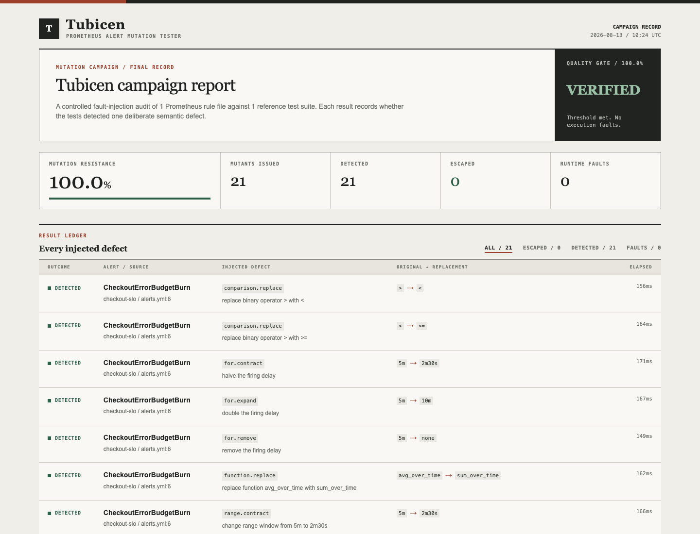
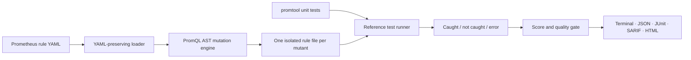

<p align="center">
  
</p>

<h1 align="center">Tubicen</h1>

<p align="center"><strong>Mutation testing for Prometheus alert rules.</strong></p>

<p align="center">
  <a href="https://github.com/iahsanGill/tubicen/actions/workflows/ci.yml"></a>
  <a href="https://pkg.go.dev/github.com/iahsanGill/tubicen"></a>
  <a href="LICENSE"></a>
</p>

`promtool test rules` proves that an alert behaves correctly for the cases you wrote. Tubicen asks the harder question: **would those tests catch a plausible defect in the rule?**

It parses each PromQL expression into an AST, makes one controlled change, writes an isolated rule file, and runs the official Prometheus checker and test engine. A mutant that still passes is a concrete gap in the alert test suite.



## Why this exists

Alert rules encode production policy: thresholds, hold periods, label scope, aggregation, and time windows. A test can cover the obvious outage while missing a broken boundary or an accidental scope change.

The example in this repository makes that visible:

| Test suite | Killed | Survived | Score |
| --- | ---: | ---: | ---: |
| One happy-path outage | 9 | 12 | 42.9% |
| Boundary and recovery cases | 21 | 0 | 100.0% |

Both suites pass against the original rules. Only the second one catches all of the tested rule changes.

## Production-style Docker demo

The repository includes a complete local monitoring setup with two checkout service replicas, Prometheus, Alertmanager, a webhook receiver, and Tubicen as an on-demand CI tool.

```bash
./demo/verify.sh
```

The script starts the stack, confirms that Prometheus can scrape both replicas, changes one replica to a 20% error ratio, stops the other replica, and waits until both checkout alerts are firing. It then shows the weak rule tests failing Tubicen's 80% gate and the stronger tests passing a 100% gate.

This demonstrates the distinction the project is built around:

- Live Prometheus proves that the current alert fires for a real scraped failure.
- Tubicen proves whether the rule test suite would catch important mistakes before a changed rule is deployed.

See [demo/README.md](demo/README.md) for the architecture, commands, ports, and cleanup instructions.


## Quick start

Requirements: Go 1.25 or newer and a `promtool` binary on `PATH`.

```bash
go install github.com/iahsanGill/tubicen/cmd/tubicen@latest

tubicen run \
  --rules examples/rules/alerts.yml \
  --tests examples/tests/strong.yml \
  --threshold 100
```

Or run the container, which includes the matching `promtool` binary:

```bash
docker build -t tubicen .
docker run --rm -v "$PWD:/workspace" -w /workspace tubicen run \
  --rules examples/rules/alerts.yml \
  --tests examples/tests/strong.yml \
  --threshold 100
```

Preview mutations without executing tests:

```bash
tubicen list --rules examples/rules/alerts.yml
```

## What Tubicen mutates

| Family | Example |
| --- | --- |
| Comparisons | `>` → `>=`, `>` → `<`, `==` → `!=` |
| Thresholds | scale nonzero values; shift a zero boundary to `-1` or `1` |
| Hold periods | remove, halve, double, or add `for` |
| Range windows | `[5m]` → `[2m30s]`, `[5m]` → `[10m]` |
| Aggregations | `sum` ↔ `avg`, `min` ↔ `max` |
| Functions | `rate` ↔ `irate`, `avg_over_time` ↔ `sum_over_time` |
| Selectors | `environment="prod"` → `environment!="prod"` |
| Set operators | `and` → `or`, `or` → `and`, `unless` → `and` |

Every generated expression is reparsed before execution. Mutated rule files are also checked by `promtool check rules`; an invalid mutant is reported as an execution error and never counted as killed.

## Reports and CI gates

```bash
tubicen run \
  --rules alerts.yml \
  --tests alerts_test.yml \
  --threshold 85 \
  --workers 4 \
  --json artifacts/tubicen.json \
  --junit artifacts/tubicen.xml \
  --sarif artifacts/tubicen.sarif \
  --html artifacts/tubicen.html \
  --survivors artifacts/survivors
```

Exit codes are stable: `0` means the quality gate passed, `1` means the campaign completed but missed its threshold, and `2` means configuration, baseline, or execution failed. Errors and timeouts always fail the gate.

Operator families can be selected with `--only threshold,for` or excluded with `--skip selector`. Use `--limit` for a fast local sample. `--rules` and `--tests` are repeatable.

## How it works



Tubicen validates the unmodified rule files and tests before starting. Mutants then run concurrently in temporary workspaces; results retain deterministic ordering and IDs. The original files are never edited.

The detailed design, isolation model, and failure semantics are in [docs/architecture.md](docs/architecture.md).

## Development

```bash
make check       # formatting, vet, unit tests, and race detector
make build       # bin/tubicen
make e2e         # real promtool campaign; set PROMTOOL if needed
make reports     # generate all report formats under dist/
```

The repository contains unit tests for AST generation, YAML rendering, test-file rewriting, process classification, scoring, reporting, and CLI behavior. CI also builds the container and runs the 21-mutant example against Prometheus 3.13.2.

## Scope and limitations

- Tubicen tests Prometheus alerting rules and `promtool` test files. Recording-rule mutation is not implemented yet.
- A surviving mutant is evidence of missing discrimination, not automatically a production bug.
- Equivalent mutants can exist. Tubicen reports them explicitly rather than guessing that they are harmless.
- Each target rule file must be referenced by at least one supplied test suite; otherwise Tubicen reports an execution error instead of scoring an untested mutant.
- Dynamic-duration PromQL fields are left unchanged when a safe scalar mutation cannot be produced.
- Runtime grows with the number of mutants and test files; concurrency is bounded with `--workers`.

## Name

A *tubicen* was a Roman military trumpeter who transmitted battlefield signals. This tool does the same job for alerting policy: it checks whether the signal still works when the rule is subtly wrong.

Tubicen is available under the [MIT License](LICENSE). Contributions are welcome; see [CONTRIBUTING.md](CONTRIBUTING.md).
