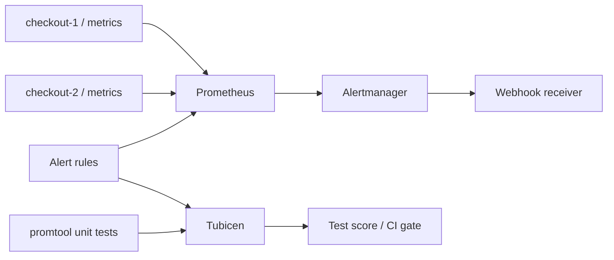
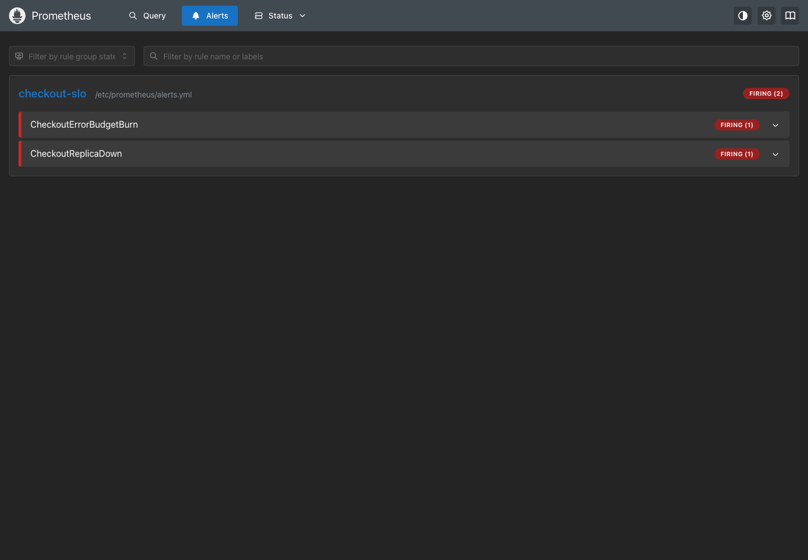

# Production-style Docker demo

This demo separates runtime monitoring from rule testing:



The Prometheus side answers: **does this alert fire against live scraped metrics?**

The Tubicen side answers: **would the rule tests catch a wrong threshold, selector, aggregation, time window, or firing delay before that change reaches Prometheus?**

Those are different checks. A live smoke test can show that the current rule fires during one outage. It does not prove that the test suite protects the rule's important behavior during future edits.



## Components

| Container | Role |
| --- | --- |
| `checkout-1` | Controllable checkout service that exposes Prometheus metrics and receives Alertmanager webhooks |
| `checkout-2` | Second checkout replica; the demo stops it to produce a real failed scrape |
| `prometheus` | Scrapes both replicas every two seconds and evaluates the alert rules every five seconds |
| `alertmanager` | Receives firing alerts and sends them to the checkout demo webhook |
| `tubicen` | Runs only as an on-demand test/CI container with the pinned `promtool` binary |

The timings are shortened for a local demonstration: the production-shaped rules use a 30-second lookback and 10-15 second firing delays. The structure is the same as a normal deployment, without making the demo take several minutes.

## Run the automated demonstration

```bash
./demo/verify.sh
```

The script proves six things:

1. Prometheus can scrape two live checkout replicas.
2. Changing `checkout-1` to a 20% error ratio supplies real degraded metrics.
3. Stopping `checkout-2` produces a real `up == 0` target.
4. Prometheus moves both checkout alerts to `firing`.
5. Alertmanager receives the alerts and delivers a real webhook notification.
6. The weak rule tests pass on the original rule but miss enough rule changes to fail Tubicen's 80% gate.
7. The stronger tests catch every generated rule change and pass a 100% gate.

Containers and volumes are removed when the script ends. Set `KEEP_DEMO=1` to leave them running for inspection:

```bash
KEEP_DEMO=1 ./demo/verify.sh
```

Then open:

- Prometheus: <http://localhost:19090/alerts>
- Alertmanager: <http://localhost:19093>
- Checkout state: <http://localhost:18080/state>
- Webhook notifications: <http://localhost:18080/notifications>

Clean up with:

```bash
docker compose -f demo/compose.yml --profile tools down --volumes
```

## Run individual scenarios

```bash
docker compose -f demo/compose.yml up -d --build

# Change the first replica from a 1% to a 20% error ratio.
curl -X POST http://localhost:18080/scenario/degraded

# Simulate losing the second replica.
docker compose -f demo/compose.yml stop checkout-2

# Inspect active Prometheus alerts.
curl http://localhost:19090/api/v1/alerts
```

Run Tubicen separately, as it would run in CI:

```bash
docker compose -f demo/compose.yml --profile tools run --rm tubicen run \
  --rules demo/prometheus/alerts.yml \
  --tests demo/tests/strong.yml \
  --threshold 100
```

Tubicen does not modify the live Prometheus container. It works on temporary copies of the rule file and invokes `promtool` in isolated workspaces. This keeps destructive test changes outside the monitoring runtime.

The host ports can be changed with `TUBICEN_CHECKOUT_1_PORT`, `TUBICEN_CHECKOUT_2_PORT`, `TUBICEN_PROMETHEUS_PORT`, and `TUBICEN_ALERTMANAGER_PORT`.
