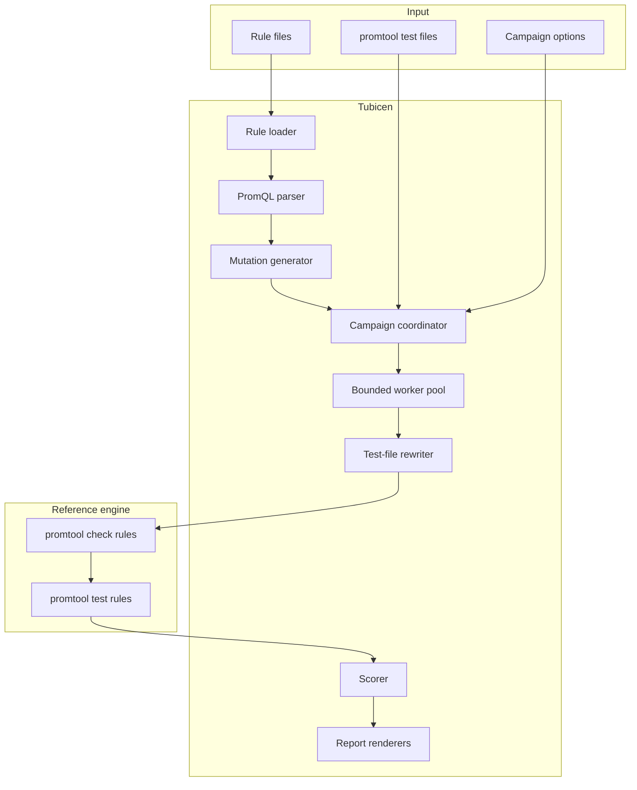
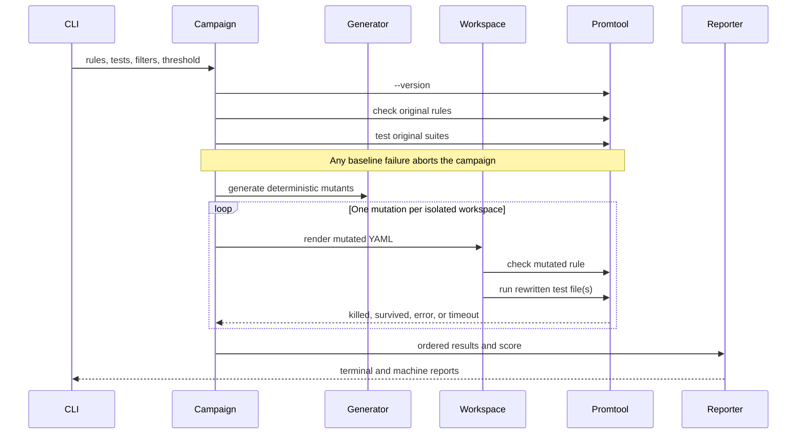

# Architecture

Tubicen is a local, deterministic mutation-testing pipeline for Prometheus alert rules. It deliberately keeps rule transformation separate from execution: the mutation engine understands PromQL, while Prometheus' own `promtool` remains the authority for rule validity and test behavior.

## System boundary

Tubicen does not reimplement PromQL evaluation. That would create a second semantics engine and make results less trustworthy. It uses the official Prometheus parser to transform expressions and the official command-line tool to validate and execute them.

## Campaign lifecycle

### 1. Baseline validation

The runner checks every original rule file and executes every original test file before mutation begins. This makes the result interpretable: a test failure after mutation can be attributed to that mutation rather than to a pre-existing broken baseline.

### 2. Rule loading

`internal/rules` decodes YAML into `yaml.Node` rather than a reduced struct. Alert metadata is indexed for mutation, while labels, annotations, group settings, comments, and unrelated rules remain in the document. Rendering deep-clones the tree and changes exactly one expression or `for` field.

The input rule file is opened read-only. Mutated files exist only in temporary workspaces unless a survivor is explicitly copied to `--survivors`.

### 3. Mutation generation

`internal/mutation` parses each alert expression with the Prometheus PromQL parser. It walks the AST, records eligible nodes, and creates one candidate for each controlled replacement. Each candidate starts from a fresh parse of the original expression, so mutations never accumulate.

Generation has four invariants:

1. Exactly one semantic change is made per mutant.
2. A generated expression must parse successfully again.
3. Ordering and short mutation IDs are stable for the same rule.
4. Duplicate rendered changes are removed.

The generator changes behavior that commonly causes alert incidents: inequality boundaries, magnitude thresholds, lookback windows, aggregation choice, function choice, label scope, logical composition, and firing delay.

### 4. Isolated execution

`internal/promtool` creates a temporary directory for each mutant and renders a single replacement rule file. It rewrites a copy of each test YAML so that:

- paths are absolute and independent of the temporary directory;
- only the target rule file points to the mutant;
- other rule files and glob expansions remain present;
- the source test and rule files are unchanged.

Suites that do not load the current target rule are skipped for that mutant. If none of the supplied suites references the target, the result is an execution error rather than a misleading survivor.

The mutant first passes through `promtool check rules`. Only a valid rule is eligible for scoring. Test files run sequentially for that mutant and stop at the first test failure, while separate mutants run concurrently through a bounded worker pool.

### 5. Outcome model

| Status | Meaning | Included in score denominator? | Gate behavior |
| --- | --- | ---: | --- |
| `killed` | At least one test rejected the valid mutant | Yes | Positive |
| `survived` | Every test passed with the mutant | Yes | Lowers score |
| `error` | Setup, validation, or process execution failed | No | Fails gate |
| `timeout` | A `promtool` command exceeded its deadline | No | Fails gate |

The score is `killed / (killed + survived) × 100`. Infrastructure failures are not disguised as successful mutant kills.

### 6. Reporting

All renderers consume the same versioned `domain.Report` value:

- terminal output for local diagnosis;
- JSON for automation and historical storage;
- JUnit XML for test tabs in CI systems;
- SARIF 2.1 for code-scanning interfaces;
- a standalone, dependency-free HTML report for sharing and review.

The campaign stores results in generation order even when workers finish out of order. This makes diffs and automation stable between runs.

## Package map

| Package | Responsibility |
| --- | --- |
| `cmd/tubicen` | CLI parsing, process exit contract, progress, report destinations |
| `internal/domain` | Mutation, result, summary, and report schema |
| `internal/rules` | Loss-minimizing YAML load, alert indexing, single-mutation render |
| `internal/mutation` | PromQL AST traversal, mutation operators, stable identities |
| `internal/promtool` | Reference process execution, timeouts, test-file path rewriting |
| `internal/campaign` | Baseline gate, filtering, concurrency, deterministic collection, scoring |
| `internal/report` | Terminal, JSON, JUnit, SARIF, and HTML encoders |

## Failure and trust model

- `promtool` is treated as an external trusted reference executable. Its path is explicit with `--promtool` and its version is recorded in every report.
- Commands use argument arrays rather than a shell, so rule and test paths are not evaluated as shell input.
- Each command has its own context deadline. Cancellation propagates from SIGINT or SIGTERM.
- Temporary directories use OS-generated names and are removed after each mutant.
- Worker count is bounded; the default is the smaller of eight and the available CPU count.
- Baseline, invalid-mutant, timeout, and test-failure paths remain distinct in the result model.

## Extension points

New operators belong in `internal/mutation` and must produce a reparseable expression plus a deterministic description. Alternative execution engines should implement the same lifecycle—baseline, mutant validation, isolated test—and preserve status semantics. New report formats should consume `domain.Report` without changing campaign execution.
